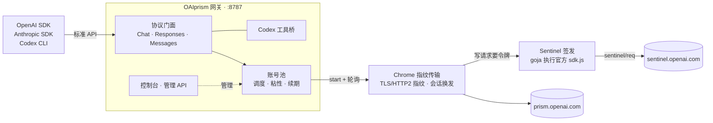

<div align="center">


<h1>OAIprism</h1>

<p><b>把 OpenAI Prism 折射成你熟悉的标准 API</b></p>

<p>
  Go 单二进制网关：OpenAI Chat / Responses、Anthropic Messages、Codex CLI 开箱即用。<br>
  多账号池调度，凭据自动续期，内置管理控制台。
</p>

<p>
  <a href="https://github.com/zhjai/oai-prism/actions/workflows/ci.yml"></a>
  <a href="https://github.com/zhjai/oai-prism/releases/latest"></a>
  <a href="go.mod"></a>
  <a href="web/package.json"></a>
  
  <a href="https://github.com/alanbulan/oai-prism/stargazers"></a>
  <a href="https://github.com/alanbulan/oai-prism/network/members"></a>
  <a href="https://github.com/alanbulan/oai-prism/commits/master"></a>
  <a href="LICENSE"></a>
</p>

<p>
  
  
  
</p>

<p>
  <a href="#快速开始">快速开始</a> ·
  <a href="docs/Linux部署指南.md">Linux 教程</a> ·
  <a href="docs/使用指南.md">使用指南</a> ·
  <a href="docs/架构与原理.md">架构与原理</a> ·
  <a href="#控制台">控制台</a> ·
  <a href="https://github.com/zhjai/oai-prism/issues">反馈问题</a>
</p>

<br>

<picture>
  <source media="(prefers-color-scheme: dark)" srcset="https://github.com/alanbulan/oai-prism/raw/master/docs/assets/screenshot-statistics-dark.png">
  
</picture>

</div>

<br>

## 为什么是 OAIprism

Prism（`prism.openai.com`）背后是强大的推理模型，但它说的是一套私有协议：
start + 轮询、`turn_state` 续令牌、浏览器指纹、Sentinel 反自动化令牌、容器沙箱……
OAIprism 把这些全部收进网关，对外只暴露你已经在用的标准接口 ——
**改一个 `base_url`，现有的 SDK、CLI 和工具链就能直接用上。**

<table>
  <tr>
    <td width="33%" valign="top">
      <b>🔌 标准协议，零改造接入</b><br><br>
      OpenAI Chat Completions / Responses、Anthropic Messages 全兼容，含完整的流式事件序列。
    </td>
    <td width="33%" valign="top">
      <b>🛠️ Codex 工具桥</b><br><br>
      上游负责思考，本地 Codex CLI 负责执行。文件真实落在你的磁盘上，修改按"定位原文 → 替换"安全落地。
    </td>
    <td width="33%" valign="top">
      <b>🧠 连续的长窗口记忆</b><br><br>
      会话历史交给上游原生保管，每轮只发增量：实测同一会话灌到 230 万 tokens，最早的内容仍逐字答对；会话按 API Key 指纹隔离，互不可见。
    </td>
  </tr>
  <tr>
    <td width="33%" valign="top">
      <b>⚖️ 多账号池</b><br><br>
      并发闸门、会话粘性、失败冷却、凭据自动续期、SQLite 持久化，运行中热重载。
    </td>
    <td width="33%" valign="top">
      <b>📊 内置控制台</b><br><br>
      账号管理、API Key 签发、吞吐与模型分布、逐笔请求审计、对话调试台，支持深色模式。
    </td>
    <td width="33%" valign="top">
      <b>🛡️ 默认安全</b><br><br>
      无 Key 时只放行本机；管理端与 API 权限分离；SSRF 防护、跨站写保护，管理接口从不回传凭据。
    </td>
  </tr>
</table>

## 快速开始

本 fork 基于 [alanbulan/oai-prism](https://github.com/alanbulan/oai-prism)，增加 Linux 教程、启动脚本和 Release 安装包。
Linux 与 Windows 都只运行一个 Go 进程，监听 8787；不需要 Node.js、Chrome、图形桌面或旧版的 8790/8791 服务。
默认浏览器指纹中的 `Windows` 是出站协议模拟，与运行网关的操作系统无关，Linux 无需修改它。

### Linux：下载 Release（推荐）

安装包支持 `linux/amd64`（x86_64）和 `linux/arm64`（aarch64），包含二进制、Dashboard、配置示例和启动脚本。
运行预编译版本不需要 Go、Node.js 或 pnpm。先准备 `curl`、`tar`、`sha256sum` 和系统 CA 证书
（Debian/Ubuntu：`sudo apt-get install ca-certificates curl tar coreutils`）。

```bash
# 选择本机架构并下载；升级时也可以在 Release 页面选择新的版本号
case "$(uname -m)" in
  x86_64) arch=amd64 ;;
  aarch64|arm64) arch=arm64 ;;
  *) echo "不支持的架构：$(uname -m)"; exit 1 ;;
esac
version=v0.1.0-zhjai.1
asset="oaiprism-${version}-linux-${arch}.tar.gz"
url="https://github.com/zhjai/oai-prism/releases/download/${version}"
curl -fLO "${url}/${asset}"
curl -fLO "${url}/SHA256SUMS"
sha256sum --check --ignore-missing SHA256SUMS

# 使用固定目录，便于后续配置 systemd
mkdir -p "$HOME/.local/share/oaiprism"
tar -xzf "$asset" -C "$HOME/.local/share/oaiprism" --strip-components=1
cd "$HOME/.local/share/oaiprism"
./oaiprism version

# 从标准输入粘贴 prism.openai.com 的整串 Cookie，按 Ctrl+D 结束
./oaiprism import -stdin -id main

# 前台启动；首次自动创建 configs/config.yaml，Ctrl+C 停止
./tools/start.sh
```

也可以不预先导入账号，直接启动后在 Dashboard 的「账号与计划池」中通过 OAuth 导入。
服务器上运行时，在自己的电脑建立 SSH 隧道，再访问本机 Dashboard：

```bash
ssh -N -L 8787:127.0.0.1:8787 user@your-server
```

完整的 [Linux 部署指南](docs/Linux部署指南.md) 包含凭据导入、systemd 常驻、日志、诊断和升级回滚。

### Linux：从源码构建

需要 **Go 1.26+**；仓库已包含 Dashboard 构建产物，未修改前端时不需要 pnpm。

```bash
git clone https://github.com/zhjai/oai-prism.git
cd oai-prism
go build -trimpath -o oaiprism ./cmd/oaiprism
./oaiprism import -stdin -id main
./tools/start.sh
```

### Windows PowerShell

从源码构建需要 Go 1.26+。

```powershell
git clone https://github.com/zhjai/oai-prism.git
cd oai-prism

# 1. 编译
go build -o oaiprism.exe ./cmd/oaiprism

# 2. 导入账号：粘贴 prism.openai.com 的 Cookie、access token 或 refresh token
.\oaiprism.exe import -stdin -id main

# 3. 启动（只有网关一个进程，监听 8787）
.\tools\start.ps1
```

启动后打开 **http://127.0.0.1:8787/dashboard/**，在右上角「API 密钥」生成一个 Key，然后调用：

```bash
curl http://127.0.0.1:8787/v1/chat/completions \
  -H "Authorization: Bearer $OAIPRISM_KEY" \
  -H "Content-Type: application/json" \
  -d '{"model":"gpt-6.1-sol","stream":true,"messages":[{"role":"user","content":"你好"}]}'
```

## 接入客户端

**Codex CLI**：写入 `~/.codex/config.toml`，即可让 Codex 在本地执行、由 Prism 推理。

```toml
model_provider = "oaiprism"
model = "gpt-6.1-sol"
model_context_window = 1000000

[model_providers.oaiprism]
name = "oaiprism"
wire_api = "responses"
requires_openai_auth = false
base_url = "http://127.0.0.1:8787/v1"
experimental_bearer_token = "<你的 Key>"
```

<details>
<summary><b>OpenAI SDK</b></summary>

```python
from openai import OpenAI

client = OpenAI(base_url="http://127.0.0.1:8787/v1", api_key="<你的 Key>")
resp = client.chat.completions.create(
    model="gpt-6.1-sol",
    messages=[{"role": "user", "content": "你好"}],
)
print(resp.choices[0].message.content)
```

</details>

<details>
<summary><b>Anthropic SDK</b></summary>

```python
import anthropic

client = anthropic.Anthropic(base_url="http://127.0.0.1:8787", api_key="<你的 Key>")
msg = client.messages.create(
    model="gpt-6.1-sol",
    max_tokens=1024,
    messages=[{"role": "user", "content": "你好"}],
)
print(msg.content[0].text)
```

</details>

<details>
<summary><b>可用模型</b></summary>

| 模型 | 推理强度变体 |
|---|---|
| `gpt-6.1-sol`（默认） | `-low` / `-high` / `-xhigh` |
| `gpt-6-luna` | `-high` / `-xhigh` |
| `gpt-5.6-sol` | `-low` / `-high` / `-xhigh` |
| `gpt-5.6-terra` | `-high` / `-xhigh` |

以 `GET /v1/models` 为准，映射表在 `facade.models` 中可按需增删。

</details>

## 控制台

内置于网关的 `/dashboard/`，无需额外部署。浅色、深色、跟随系统三种外观。

<p align="center">
  
  &nbsp;
  
</p>

<p align="center">
  <sub><b>账号与计划池</b>：健康状态、凭据有效期、并发与失败统计 &nbsp;·&nbsp; <b>Chat 调试台</b>：切换模型与推理强度，HTML / SVG 即时预览</sub>
</p>

## 架构



客户端请求在网关被翻译为上游的 start + 轮询协议，以 Chrome 的 TLS 指纹直连 Prism 发出；
写请求需要的 Sentinel 反自动化令牌在进程内纯 Go 签发：嵌入式 JS 引擎原样执行官方 SDK，
它看到的浏览器环境取自真实 Chrome 的快照。轮询结果再被还原为 token 级增量 SSE 推回客户端。
全部在一个 Go 进程里，没有浏览器、没有附属服务。

深入阅读：[多轮上下文](docs/架构与原理.md#多轮上下文) ·
[Codex 工具桥](docs/架构与原理.md#codex-工具桥) ·
[上游协议](docs/架构与原理.md#上游协议已实测校准) ·
[Sentinel 纯 Go 签发](docs/架构与原理.md#sentinel-纯-go-签发) ·
[沙箱](docs/架构与原理.md#沙箱) ·
[安全设计](docs/架构与原理.md#安全设计) ·
[性能设计](docs/架构与原理.md#性能设计)

## 文档

| 文档 | 内容 |
|---|---|
| [Linux 部署指南](docs/Linux部署指南.md) | Release 安装、源码构建、账号导入、SSH 隧道、systemd、日志与升级回滚 |
| [使用指南](docs/使用指南.md) | 安装启动、鉴权与 API Key、客户端接入、端点与控制头、运维配置、部署回滚 |
| [架构与原理](docs/架构与原理.md) | 系统架构、多轮上下文、工具桥、上游协议、沙箱、安全与性能设计、目录结构 |
| [协议校准报告](docs/协议校准报告.md) | 上游推理协议的实测字段与行为 |
| [Prism 完整调用链](docs/Prism完整调用链.md) | 从建项目到生成完成的全部请求 |
| [Yjs 依赖调研与沙箱方案](docs/Yjs依赖调研与沙箱方案.md) | 沙箱同步机制与前置流程 |
| [部署报告](docs/PrismOpenAIProxy-部署报告.md) · [对齐核对](docs/PrismOpenAIProxy-对齐核对.md) | 部署实录与接口对齐清单 |

## 开发

```bash
# 提交前本地门禁（与 CI 完全一致）
go vet ./... && go test ./... && go test -race ./...
cd web && pnpm install && npx tsc --noEmit && pnpm build
```

- `-race` 不可省略：账号池、粘性表、SSE 写出、会话链、热重载都是并发结构；
- 测试包含**模拟上游**的端到端用例，以及在 pwsh、Windows PowerShell、bash + python3 中
  **真实执行**合成补丁脚本、逐字节核对落盘结果的回归测试；
- CI 在任意分支 push / PR 时运行 Go 门禁（vet → test → race → 构建 → 交叉编译 linux/amd64、arm64）
  与 Dashboard 门禁（tsc → vite build）。
- 推送 `v*` 标签触发 Release 工作流：完成 Go 与 Dashboard 门禁后，为 Linux amd64/arm64 打包并生成 `SHA256SUMS`。
  本地等价打包命令：`./tools/package_linux.sh v0.1.0-zhjai.1`，产物位于 `dist/`。

欢迎提交 Issue 与 Pull Request。较大的改动请先开 Issue 讨论方向。

## Star History

<a href="https://star-history.com/#alanbulan/oai-prism&Date">
  <picture>
    <source media="(prefers-color-scheme: dark)" srcset="https://api.star-history.com/svg?repos=alanbulan/oai-prism&type=Date&theme=dark">
    
  </picture>
</a>

## 许可证

[MIT](LICENSE) © 2026 alanbulan

## 声明

OAIprism 是独立的社区项目，与 OpenAI 不存在任何隶属、合作或背书关系。
使用前请自行确认符合上游服务条款；账号凭据只保存在本机，仅用于与 OpenAI 官方服务通信。

<div align="center">
<br>
<sub>如果 OAIprism 对你有帮助，欢迎点一个 ⭐ 让更多人看到它。</sub>
</div>
